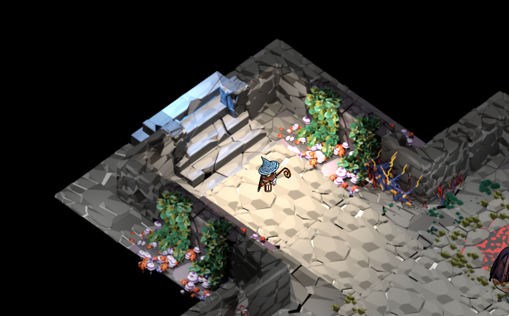

# The Darkest hour

Made for Gamedev.js game jam - April 2023: https://itch.io/jam/gamedevjs-2023

Game jam entry: https://itch.io/jam/gamedevjs-2023/rate/2037103

Play it on itch.io: https://lovbos.itch.io/the-darkest-hour

> A legends says that deep down in this ruins a secret can be found. A secret such worthy that told by many. But tried by few. A risky venture with a terrible curse for the ones who try. A curse trapping them forever, never letting them to return. Becoming something dark and vile. A loss of light, endless darkness. A creature of dark, endless dweller of the ruins.

> After a daylong exploration of a dungeon underneath the ruins of an old abandoned castle, you ought to return to the surface. As the night slowly falls outside, you come to realize the rooms you have been wandering suddenly feel different. Is someone or something watching? The suspense has grown to the point it can physically be felt.

> The lantern you have been carrying has been running out of oil and there is no much time before everything becomes completely dark. You must leave the place now. Or this might be the darkest hour of your life...

Codename: `ribiz-jam` (word play. In Croatian "jam" phonetically sounds like word "džem" meaning "marmalade". "Ribiz" is fruit (currant) from which marmelade is often being made.)